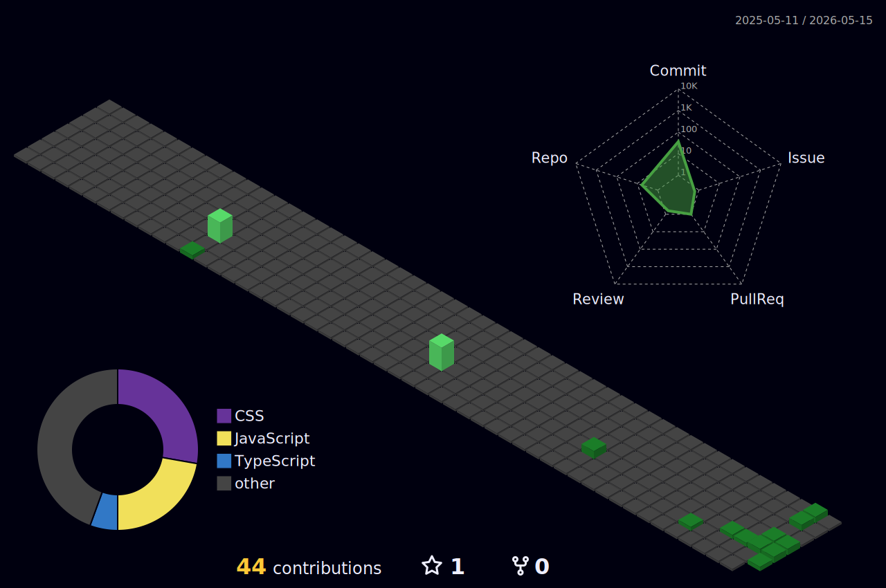

<h1 align="center">Jadi Pereira Borges</h1>

  Desenvolvedora Web | Angular • TypeScript • Python

---

---

## Sobre

- Estudante de Sistemas Para Internet
- Experiência com HTML, CSS, Angular, TypeScript e Python
- Inglês intermediário

## Projetos em destaque

🐾 PetVitaliz
Sistema web para gerenciamento e adoção de pets desenvolvido com Angular.

🔗 https://github.com/PetVitaliz/petvitaliz-web

---

🍕 Projeto Pizzaria
Landing page responsiva de pizzaria desenvolvida com HTML, CSS e JavaScript.

🔗 https://github.com/jadiborgees/projeto-pizzaria

## Contato

[LinkedIn](https://www.linkedin.com/in/jadi-b-69a215113/)

---

> Construindo experiências digitais com código e criatividade.
