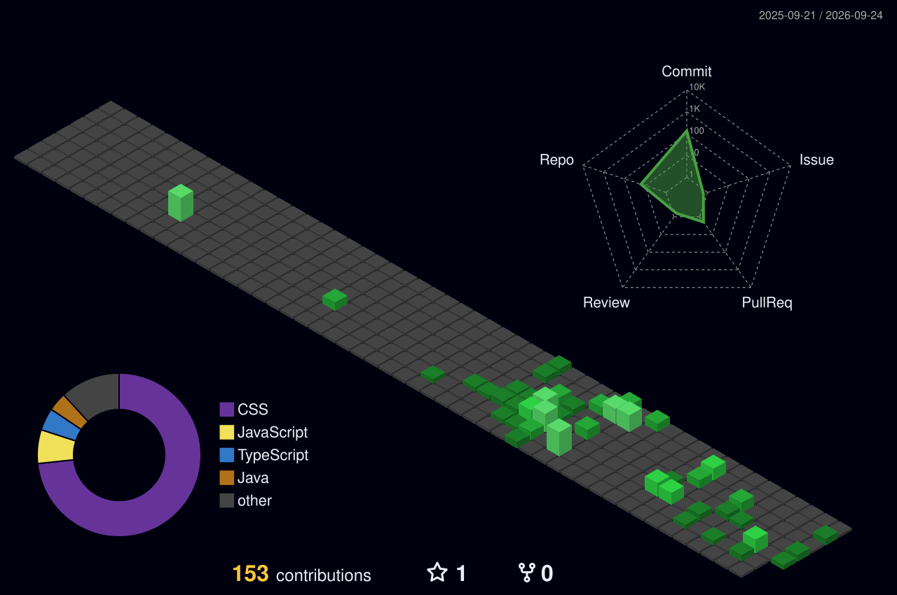

# 👩‍💻 Jadi Pereira Borges

### Desenvolvedora Front-end

 

---

## 👩‍💻 Sobre mim

Sou estudante de **Tecnologia em Sistemas para Internet**, com foco em **Desenvolvimento Front-end**.

Tenho experiência prática no desenvolvimento de aplicações e interfaces web **modernas, responsivas e componentizadas**, utilizando principalmente **Angular, React, JavaScript e TypeScript**.

Também possuo conhecimentos em **Node.js, Python, SQL e APIs REST**, além de experiência com **Git, GitHub, Figma, responsividade, componentização e integração de APIs**.

- 🎓 Tecnologia em Sistemas para Internet
- 💻 Foco em Desenvolvimento Front-end
- 🅰️ Angular e TypeScript
- ⚛️ React
- 🎨 Interesse em UI/UX e interfaces modernas
- 🔗 Consumo e integração de APIs REST
- 🌎 Inglês intermediário

---

## 🚀 Tecnologias

### 🎨 Front-end

  

  

### ⚙️ Back-end & Banco de Dados

  

  

### 🛠️ Ferramentas & Design

  

---

## ✨ Projetos em destaque

<table>
<tr>

<td width="50%" valign="top">

<h3 align="center">🐾 PetVitaliz</h3>

  Plataforma web para gerenciamento da saúde e dos cuidados com pets.

  

🔹 Desenvolvimento com Angular  
🔹 Interface responsiva  
🔹 Componentização  
🔹 Gerenciamento de informações dos pets  
🔹 Integração com APIs REST  
🔹 Foco em experiência do usuário  

</td>

<td width="50%" valign="top">

<h3 align="center">✨ Elegance Cintra Beauty</h3>

  Catálogo digital de perfumes com uma interface moderna, sofisticada e responsiva.

  

🔹 Catálogo de produtos  
🔹 Busca e filtros  
🔹 Sistema de favoritos  
🔹 Carrinho de compras  
🔹 Cálculo de frete  
🔹 LocalStorage  
🔹 Integração com WhatsApp  

</td>

</tr>
</table>

 

<table>
<tr>

<td width="50%" valign="top">

<h3 align="center">🍕 Projeto Pizzaria</h3>

  Landing page responsiva desenvolvida para uma pizzaria.

  

🔹 Layout responsivo  
🔹 Interface moderna  
🔹 Navegação intuitiva  
🔹 Desenvolvimento Mobile First  
🔹 Interações com JavaScript  

</td>

<td width="50%" valign="top">

<h3 align="center">🚀 Mais projetos</h3>

  Outros projetos e estudos desenvolvidos durante minha evolução como desenvolvedora Front-end.

  

🔹 Angular  
🔹 React  
🔹 TypeScript  
🔹 JavaScript  
🔹 APIs REST  
🔹 Interfaces responsivas  

</td>

</tr>
</table>

---

## 📊 GitHub

---

## 🌱 Minhas contribuições

---

## 🎯 Atualmente

💻 **Desenvolvimento Front-end**

🅰️ Angular &nbsp;•&nbsp; ⚛️ React &nbsp;•&nbsp; 🔷 TypeScript

🎨 UI/UX &nbsp;•&nbsp; 📱 Responsividade &nbsp;•&nbsp; 🔗 APIs REST

 

**Sempre buscando transformar ideias em interfaces funcionais, modernas e intuitivas.**

---

## 📫 Contato

### Vamos nos conectar?

 

  

### ✨ Construindo experiências digitais com código e criatividade.

